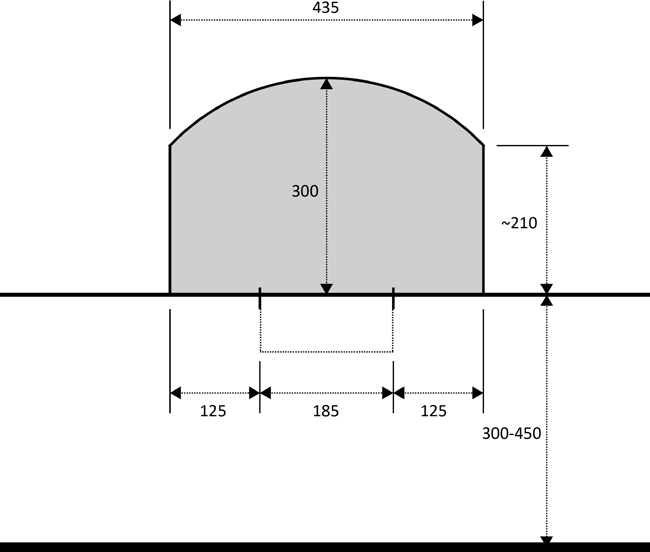
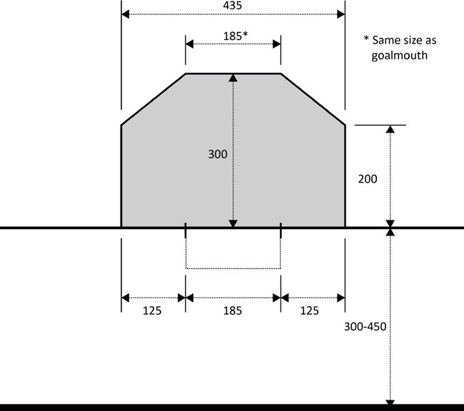

---
layout:
  title:
    visible: true
  description:
    visible: false
  tableOfContents:
    visible: true
  outline:
    visible: true
  pagination:
    visible: false
---

# 🥅 Section 2: Game Facilities

## **2.1. Court**

***

### **2.1.1. Size**&#x20;

* **2.1.1.1.** Courts are no larger than 45 ± 0.5m by 25 ± 0.5m and no smaller than 35 ± 0.5m by 18 ± 0.5m.&#x20;

### **2.1.2. Boards**&#x20;

* **2.1.2.1.** Courts must be bordered by a solid perimeter that is securely held together.&#x20;
* **2.1.2.2.** Boards on the perimeter must be at least 1.2 ± 0.2m tall.&#x20;
  * **2.1.2.2.1.** In case of lower boards, the Head Referee may implement additional rules regarding physical contact and out-of-play balls.&#x20;
* **2.1.2.3.** There must be no gaps in the perimeter that would allow a ball or any part of the player’s body or equipment to go in.&#x20;

### **2.1.3. Doors**&#x20;

#### **2.1.3.1. 3v3 Format**&#x20;

* **2.1.3.1.1.** There must be at least one entrance to the court.&#x20;
  * **2.1.3.1.1.1.** If two entrances are available, they must be symmetrical to the center line of the court.&#x20;

#### **2.1.3.2. Quads Format**&#x20;

* **2.1.3.2.1.** There must be at least one entrance to the court.&#x20;
  * **2.1.3.2.1.1.** If only one entrance is available, or if both entrances are either not symmetrical to the center line of the court, or equally as accessible to player to enter or exit; a team my call for a substitution timeout as per [5.13.1](section-5-game-mechanics.md#id-5.13.-bench-mechanics).&#x20;
* **2.1.3.2.2.** On a court with two entrances symmetrical to the center line, an arc will be marked 3 ± 0.25m from the center of each door and is referred to as the player transition area.&#x20;

#### **2.1.3.3. Squad Format**&#x20;

* **2.1.3.3.1.** There must be two entrances to the court, symmetrical to the center line.&#x20;
* **2.1.3.3.2.** An arc will be marked 3 ± 0.25m from the center of each door and is referred to as the player transition area.&#x20;

### **2.1.4. Lines**&#x20;

* **2.1.4.1.** All lines must be a maximum of 5cm wide.&#x20;
*   **2.1.4.2.** The court will be segmented across its entire width in three locations:

    * [x] Mid court, or Center Line
    * [x] both Goal Lines&#x20;

    * **2.1.4.2.1.** The middle point of the center line will be marked for placing the ball for jousts.
* **2.1.4.3.** Goal Lines must be parallel to the backboard and 3-4.5m from it, depending on court size.&#x20;
  * **2.1.4.3.1.** Goal Lines cannot be less than 29 ± 0.5m apart from each other.&#x20;
* **2.1.4.4.** Goal Lines must be marked for the positioning of the Goalmouths, centered in regard to the width of the court, defining what will be referred to as the Goalmouth Line.
  * &#x20;**2.1.4.4.1.** The Goalmouth Line must be bound by two (2) perpendicular lines extending 10 ± 1cm towards center-court and 20 ±1cm towards the back of the goal.&#x20;
  * **2.1.4.4.2.** The two vertical lines must coincide with the dimensions of the goals used, taking the inside of the goalposts as reference.

### **2.1.5. Tap-in Area**&#x20;

* **2.1.5.1.** Two (2) lines will be marked on the boards on both sides of the court and will be referred to as the <mark style="background-color:yellow;">tap-in area</mark>.&#x20;
* **2.1.5.2.** The lines will be drawn 0.75 ± 0.10m from the center line at each side.&#x20;

### **2.1.6. Crease**&#x20;

* **2.1.6.1.** An area in front of the goal will be marked and referred to as the <mark style="background-color:yellow;">crease</mark>.&#x20;
* **2.1.6.2.** The dimension of the crease must be a semicircle of 3 ± 0.1m from the center of the goal opening, cropped to 1.25 ± 0.1m from the outside of each Goalmouth marking. Refer to [Diagram 1](section-2-game-facilities.md#id-2.1.6.-crease).&#x20;
  * **2.1.6.2.1.** The crease may be drawn by straight lines according to [Diagram 2](section-2-game-facilities.md#id-2.1.6.-crease).\



<figure><figcaption>
Diagram 1. Crease
</figcaption></figure>



<figure><figcaption>
Diagram 2. Alternate Version Crease
</figcaption></figure>



## **2.2. Goals**&#x20;

***

* **2.2.1.** Goals must have nets.&#x20;
* **2.2.2.** Goals must have a firm top crossbar positioned above the Goal Line.&#x20;
* **2.2.3.** Goals are placed with both Goalmouths facing each other, at the positions marked on the Goal Line.&#x20;
* **2.2.4.** The Goalmouth is 185 ± 5cm wide, measured from the interior of the goalposts.&#x20;
* **2.2.5.** The Goalmouth is 90 ± 5cm tall, measured from the ground to the bottom of the crossbar.&#x20;
* **2.2.6.** The goal is 80 ± 15cm deep, measured from the center of the goal line.

## **2.3. Balls**&#x20;

***

* **2.3.1.** Balls must be 67 ± 2mm in diameter.&#x20;
* **2.3.2.** Balls must weigh 70 ± 5g.&#x20;
* **2.3.3.** Balls must be made of a low-bounce, impact resistant material.&#x20;
  * **2.3.3.1.** Hardness of the material must be matched to its optimal performance temperature.

